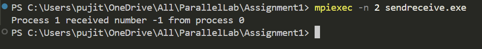

# Simple MPI Send and Receive Example

## Description
This program demonstrates basic point-to-point communication in MPI using `MPI_Send` and `MPI_Recv`. A message is sent from process 0 to process 1.

## How It Works
1. The program initializes MPI using `MPI_Init`.
2. The total number of processes (`world_size`) and the rank of each process (`world_rank`) are obtained.
3. If the number of processes is less than 2, the program aborts.
4. Process 0 initializes a number and sends it to process 1 using `MPI_Send`.
5. Process 1 receives the number from process 0 using `MPI_Recv` and prints it.
6. The program finalizes MPI using `MPI_Finalize`.

## MPI Send and Receive Syntax
### `MPI_Send`
```c
int MPI_Send(const void *buf, int count, MPI_Datatype datatype, int dest, int tag, MPI_Comm comm);
```
- `buf`: Pointer to the data to be sent.
- `count`: Number of elements to send.
- `datatype`: Data type of the elements (e.g., `MPI_INT`).
- `dest`: Rank of the destination process.
- `tag`: Message tag for identifying messages.
- `comm`: Communicator (usually `MPI_COMM_WORLD`).

### `MPI_Recv`
```c
int MPI_Recv(void *buf, int count, MPI_Datatype datatype, int source, int tag, MPI_Comm comm, MPI_Status *status);
```
- `buf`: Pointer to the buffer where the received data will be stored.
- `count`: Maximum number of elements to receive.
- `datatype`: Data type of the elements (e.g., `MPI_INT`).
- `source`: Rank of the sending process (`MPI_ANY_SOURCE` for any sender).
- `tag`: Message tag (`MPI_ANY_TAG` to accept any tag).
- `comm`: Communicator (usually `MPI_COMM_WORLD`).
- `status`: Structure that stores information about the received message.

```
```

## Output Example  
Here’s an example of the program output:  

  

