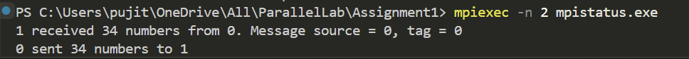

# MPI Probe and Dynamic Memory Allocation Example

## Description
This program demonstrates the use of `MPI_Probe` to dynamically allocate memory before receiving messages in MPI. Unlike a standard `MPI_Recv`, where the buffer size must be predefined, `MPI_Probe` allows the receiver to check the incoming message size before allocating the required memory. This ensures efficient memory usage and prevents buffer overflow issues.

## How It Works
1. The program initializes MPI and verifies that exactly **two processes** are used.
2. **Process 0 (Sender):**
   - Generates a random number of integers.
   - Sends this array to **Process 1** using `MPI_Send`.
3. **Process 1 (Receiver):**
   - Uses `MPI_Probe` to check the size of the incoming message.
   - Dynamically allocates memory based on the received message size.
   - Receives the data using `MPI_Recv`.
   - Frees the allocated memory after use.

## Syntax
### MPI_Probe
```c
int MPI_Probe(int source, int tag, MPI_Comm comm, MPI_Status *status);
```
- `source`: Rank of the sending process.
- `tag`: Message tag (must match the sender’s tag).
- `comm`: MPI communicator.
- `status`: MPI_Status object that contains information about the message.

## Output Example  
Here’s an example of the program output:  

  

