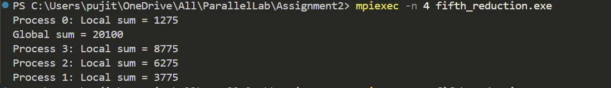

# Parallel Reduction using MPI

This project demonstrates **Parallel Reduction** using **MPI**. The code calculates the sum of elements in an array using parallel reduction across multiple processes.

---

## **What is Parallel Reduction?**
Parallel Reduction is a collective operation where multiple processes compute a global result by combining local results. It is widely used for:
- Summing values across processes  
- Finding the minimum/maximum value  
- Computing logical operations (AND, OR)  

### **How Parallel Reduction Works**
1. Each process computes a local result based on its assigned data.
2. The local results are combined using a reduction operator (e.g., sum, min, max) in a hierarchical or binary tree manner.
3. The final result is available on the root process.

### **MPI_Reduce**
In MPI, the `MPI_Reduce` function is used for parallel reduction.  
Syntax:
```c
int MPI_Reduce(
    void *sendbuf,         // Local value to be reduced
    void *recvbuf,         // Result buffer on root process
    int count,             // Number of elements
    MPI_Datatype datatype, // Type of data (e.g., MPI_INT)
    MPI_Op op,             // Reduction operator (e.g., MPI_SUM)
    int root,              // Root process where the result is stored
    MPI_Comm comm          // Communicator
);
```

---

## **Code Explaination**
1. MPI is initialized, and the rank and size of the processes are determined.
2. The array size is divided equally among processes. Each process computes its local sum. 
3.  `MPI_Reduce` combines all local sums into a global sum at the root process (rank 0).
4.  Each process prints its local sum. The root process prints the global sum.
5.  Memory is freed, and MPI is finalized.  

## Output Example  
Here’s an example of the program output:  

  

   

