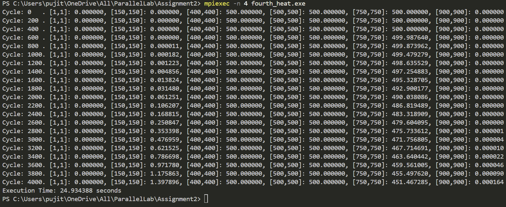

# Heat Distribution Simulation using MPI

This project simulates the diffusion of heat across a 2D grid using the **finite difference method**. The simulation is parallelized using **MPI** to improve computational efficiency by distributing the workload across multiple processes.

---

## **Description**
- The program models the spread of heat in a 2D grid over a fixed number of time steps.
- Heat diffuses based on neighboring values according to the finite difference equation:
\[
\text{new\_grid}[i][j] = \text{grid}[i][j] + C_x \cdot (\text{grid}[i+1][j] + \text{grid}[i-1][j] - 2 \cdot \text{grid}[i][j]) + C_y \cdot (\text{grid}[i][j+1] + \text{grid}[i][j-1] - 2 \cdot \text{grid}[i][j])
\]
- The simulation is divided among multiple processes using MPI:
  - Each process handles a portion of the grid.
  - Results are synchronized and combined after each step.

---

## **How It Works**
1. **Initialization:**
   - A 2D grid of size `X_SIZE x Y_SIZE` is initialized.
   - Central region (`[CMin, CMax]`) is set to a higher initial temperature.
   - Other cells are initialized to zero (cold).

2. **Parallel Computation (MPI):**
   - The grid is divided row-wise among the MPI processes.
   - Each process computes the heat diffusion for its assigned rows.
   - Results are gathered and synchronized using `MPI_Gather` and `MPI_Bcast`.

3. **Finite Difference Method:**
   - The temperature update is computed based on neighboring cell values.
   - Controlled by constants `Cx` and `Cy` (diffusion coefficients).

4. **Printing Results:**
   - The program prints temperature values at specific grid points at fixed intervals.

5. **Termination:**
   - The program runs for a fixed number of time steps.
   - Execution time is displayed at the end.

---
## Output Example  
Here’s an example of the program output:  

  

