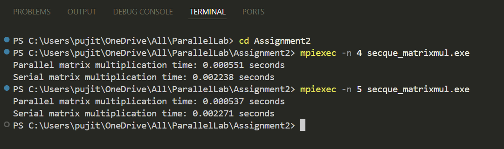

# Parallel Matrix Multiplication using MPI  

## Description  
This program performs matrix multiplication in parallel using MPI. It compares the execution time of parallel matrix multiplication with serial matrix multiplication to demonstrate the performance improvement achieved through parallelization.  

## How It Works  
1. The matrices **A** and **B** are initialized in the root process (rank 0).  
2. Matrix **B** is broadcasted to all processes using `MPI_Bcast`.  
3. Matrix **A** is divided into equal parts and scattered to all processes using `MPI_Scatter`.  
4. Each process computes its part of the result matrix **C** using local matrix multiplication.  
5. Results are gathered into the final matrix **C** using `MPI_Gather`.  
6. Execution time for parallel and serial matrix multiplication is measured and printed.  

## Output Example  
Here’s an example of the program output:  

  

