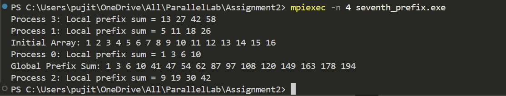

# Parallel Prefix Sum using MPI  

## Description  
This program computes the prefix sum of an array in parallel using MPI. It distributes the array among multiple processes, computes local prefix sums, and then adjusts them to obtain the final global prefix sum.  

## How It Works  
1. The root process (rank 0) initializes the global array.  
2. The array is divided into equal parts and scattered to all processes using `MPI_Scatter`.  
3. Each process computes the **local prefix sum** on its assigned segment.  
4. The last element of each process's local prefix sum is gathered at the root using `MPI_Gather`.  
5. The root process computes the prefix sum of these last elements.  
6. The updated values are scattered back to adjust the local results.  
7. The final prefix sum is gathered into the root process using `MPI_Gather`.  
8. The program prints both local and global prefix sums.  

## Output Example  
Here’s an example of the program output:  

  
