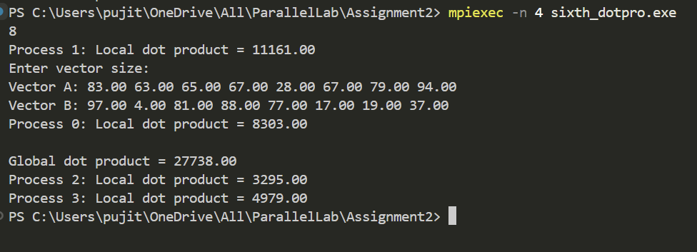

# Dot Product Calculation using MPI

## Description
This program calculates the dot product of two vectors in parallel using MPI. Each process computes the dot product of its local segment of the vectors, and the results are reduced to compute the final global dot product.

---

## How It Works
1. Initialize MPI environment.
2. Rank 0 generates two random vectors of size `n` (values between 1 and 100).
3. Scatter the vectors among all processes.
4. Each process computes the local dot product of its segment.
5. Local results are reduced using `MPI_Reduce()` to compute the global dot product.
6. Display the initial vectors, local dot product, and final global dot product.

---

## Output Example  
Here’s an example of the program output:  

  
