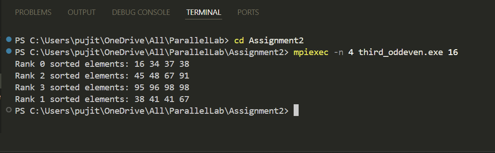

# Odd-Even Sort using MPI

This project implements the **Odd-Even Sort** algorithm using **MPI** for parallel processing. The program sorts an array of integers distributed across multiple processes using an odd-even sorting approach.

---

## Overview
Odd-Even Sort is a parallel sorting algorithm that works by alternating between two phases:
1. **Odd Phase:**  
   - Processes with odd ranks exchange boundary elements with neighboring even-ranked processes and sort them.

2. **Even Phase:**  
   - Processes with even ranks exchange boundary elements with neighboring odd-ranked processes and sort them.

The process repeats until the entire array is sorted.

---

## How It Works
1. The array is divided among the processes.
2. Each process sorts its local data using `qsort`.
3. The odd-even sorting phase begins:
   - **Odd Phase:** Neighboring odd and even ranks exchange boundary elements and sort them.
   - **Even Phase:** Neighboring even and odd ranks exchange boundary elements and sort them.
4. The process repeats until all elements are sorted globally.
5. The sorted data is gathered and displayed by the root process.

---
## Output Example  
Here’s an example of the program output:  

  

