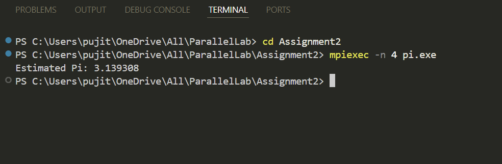

# Monte Carlo Pi Estimation using MPI  

## Description  
This program estimates the value of Pi using the Monte Carlo method in a parallel computing environment with MPI. The Monte Carlo method involves generating random points within a square and counting how many fall within a circle inscribed in the square. The ratio of points inside the circle to the total number of points approximates Pi.  

## How It Works  
1. The program initializes the MPI environment.  
2. The total number of points is divided among all available processes.  
3. Each process generates random points and counts how many fall within the circle.  
4. `MPI_Reduce` is used to sum the counts from all processes.  
5. The master process (rank 0) computes the final Pi estimate and prints the result.  

## Output Example  
Here’s an example of the program output:  

  

