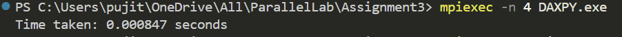

# README: MPI Parallel DAXPY Operation

## Overview
This program performs a parallel implementation of the **DAXPY** operation using **MPI** (Message Passing Interface). The operation follows the formula:


## Code Explanation
1. **Initialize MPI**:
   - Retrieves the rank (ID) of the process and total number of processes.

2. **Memory Allocation**:
   - The root process (rank 0) initializes `X` and `Y` vectors.
   - Each process receives a chunk of `X` and `Y`.

3. **Scatter Data**:
   ```c
   MPI_Scatter(X, local_n, MPI_DOUBLE, local_X, local_n, MPI_DOUBLE, 0, MPI_COMM_WORLD);
   MPI_Scatter(Y, local_n, MPI_DOUBLE, local_Y, local_n, MPI_DOUBLE, 0, MPI_COMM_WORLD);
   ```
   - Distributes parts of `X` and `Y` among all processes.

4. **DAXPY Computation**:
   ```c
   daxpy(a, local_X, local_Y, local_n);
   ```
   - Performs the operation locally on each process.

5. **Gather Results**:
   ```c
   MPI_Gather(local_X, local_n, MPI_DOUBLE, X, local_n, MPI_DOUBLE, 0, MPI_COMM_WORLD);
   ```
   - Combines computed parts into the root process.

6. **Performance Measurement**:
   ```c
   start_time = MPI_Wtime();
   end_time = MPI_Wtime();
   ```
   - Measures execution time.

## Output Example  
Here’s an example of the program output:  

  


