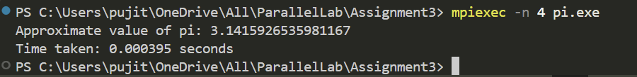

# MPI Parallel Computation of Pi

## Overview
This program calculates an approximation of the mathematical constant **pi (\u03c0)** using the numerical integration method in a **parallel computing** environment with **MPI (Message Passing Interface)**. The **integration formula** used is:

\[ \pi \approx \sum \frac{4}{1 + x^2} \]

Each process calculates a portion of the sum and contributes to the final result using **MPI_Reduce**.

## Explanation of the Code
### 1. Initialization and Setup
- The MPI environment is initialized using `MPI_Init()`.
- The rank of each process and the total number of processes are obtained using:
  ```c
  MPI_Comm_rank(MPI_COMM_WORLD, &rank);
  MPI_Comm_size(MPI_COMM_WORLD, &size);
  ```
- The number of steps (`num_steps`) is broadcasted to all processes using `MPI_Bcast()`.

### 2. Parallel Computation of Pi
- The numerical integration is performed in a loop where each process computes a subset of the sum:
  ```c
  for (int i = rank; i < num_steps; i += size) {
      x = (i + 0.5) * step;
      sum += 4.0 / (1.0 + x * x);
  }
  ```

### 3. Reduction of Partial Results
- Each process sends its computed sum to **process 0** using:
  ```c
  MPI_Reduce(&sum, &total_sum, 1, MPI_DOUBLE, MPI_SUM, 0, MPI_COMM_WORLD);
  ```
- Process **0** computes the final value of **pi** and prints the result.

### 4. Time Measurement
- The execution time is measured using `MPI_Wtime()` before and after computation.

## Output Example  
Here’s an example of the program output:  

  
