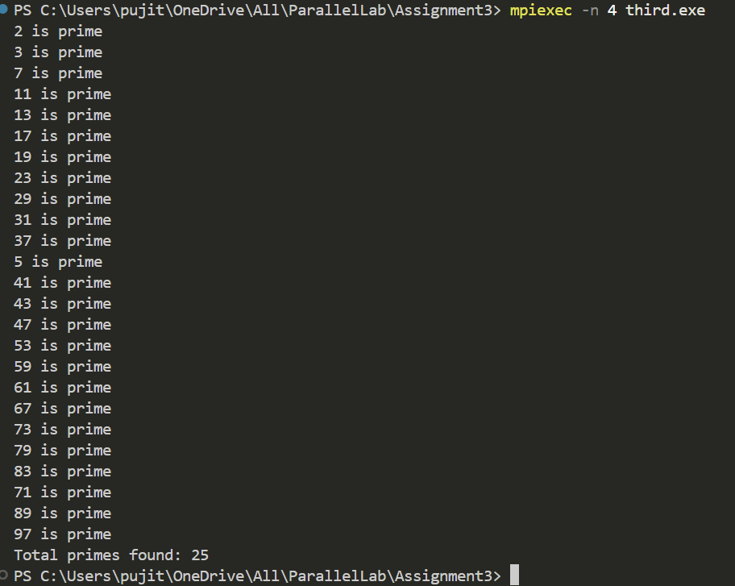

# MPI Parallel Prime Number Finder

## Overview
This program uses MPI (Message Passing Interface) to distribute the task of finding prime numbers up to a specified maximum value among multiple processes. The master process (rank 0) assigns numbers to worker processes, which determine if the number is prime and send results back to the master.

## How It Works
- **Master Process (Rank 0):**
  - Sends numbers to worker processes to check for primality.
  - Receives results from workers and prints prime numbers.
  - Continues assigning numbers until reaching the max value.
  - Sends termination signal (`-1`) to all worker processes once all numbers are tested.

- **Worker Processes (Rank > 0):**
  - Continuously request numbers from the master.
  - Check if the received number is prime.
  - Send the result back to the master.
  - Terminate when receiving the termination signal (`-1`).

## MPI Functions Used
### `MPI_Send(&data, count, datatype, dest, tag, MPI_COMM_WORLD);`
Sends data from one process to another.

### `MPI_Recv(&data, count, datatype, source, tag, MPI_COMM_WORLD, &status);`
Receives data from another process.

## Output Example  
Here’s an example of the program output:  

  

