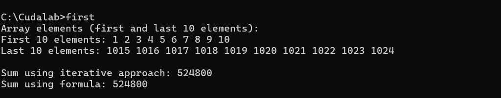

# CUDA Sum Computation Example

## Overview
This program demonstrates two methods of calculating the sum of the first N integers using CUDA:
1. Iterative summation on the GPU.
2. Formula-based summation on the GPU.

## Steps Involved

1. Set the array size `N`, number of threads per block, and number of elements to display.
2. Prepare pointers for host and device memory for input and output arrays.
3. Allocate memory for the input array and output results on the host.
4. Populate the input array with the first `N` integers (1 to N).
5. Display the first and last few elements of the array for verification.
6. Use `cudaMalloc` to allocate memory on the device for input and output arrays.
7. Transfer the input array from the host to the GPU.
8. Set up the number of threads per block and the number of blocks
9. Execute the kernel that performs the summation iteratively using a single thread.
10. Execute the kernel that calculates the sum using the arithmetic formula.
11. Retrieve the results of both summation methods from the GPU.
12. Print both the iterative and formula-based sum values.
13. Release memory on both host and device.

## Output

