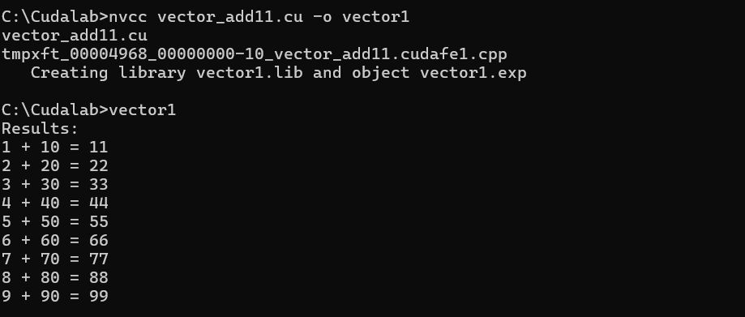
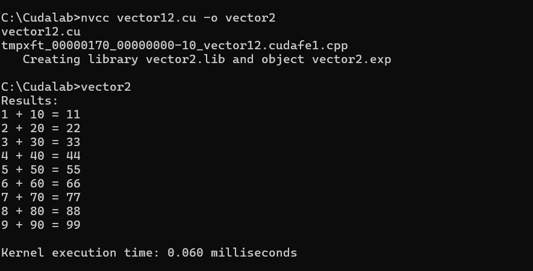
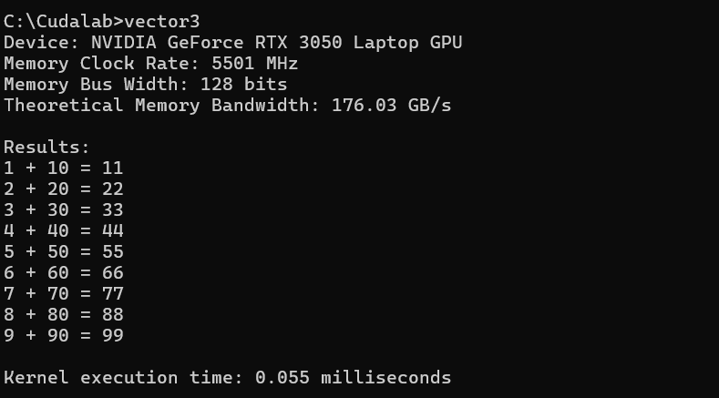
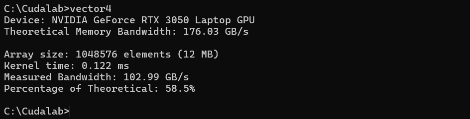

# CUDA Vector Addition Example

## Overview
This program demonstrates basic CUDA programming by performing element-wise addition of two integer arrays using GPU acceleration.

## Steps Involved

1. Set the size of the arrays and initialize the input arrays `a` and `b` on the host (CPU).
2. Allocate pointers for device (GPU) memory for arrays `a`, `b`, and `c`.
3. Use `cudaMalloc` to allocate memory for the arrays on the GPU.
4. Use `cudaMemcpy` to copy input arrays `a` and `b` from the host to the device.
5. Run the CUDA kernel with 1 block and `N` threads, where each thread computes one element of the output array.
6. Use `cudaDeviceSynchronize` and `cudaGetLastError` to ensure the kernel completed without errors.
7. Use `cudaMemcpy` to copy the result array `c` from device to host.
8. Display the results of the addition for each element.
9. Clean up by freeing the allocated GPU memory using `cudaFree`.

## Output Example  
Here’s an example of the program output:  

  

##1.1 Using statically defined global variables
Code that uses statically defined global variables (device symbols) instead of dynamically allocated memory

## Key changes made:

1. Removed `cudaMalloc` and `cudaFree` calls since we're using static allocation
2. Defined device memory using `__device__` qualifier with compile-time size
3. Modified the kernel to use the global device variables directly (no parameters needed)
4. Used `cudaMemcpyToSymbol` and `cudaMemcpyFromSymbol` instead of regular cudaMemcpy
5. Simplified the kernel launch since no parameters need to be passed

## Output 

##1.2 Record timing data of the kernel execution.
Records and prints the kernel execution time using CUDA events.

## Key changes made:

1. Added CUDA event objects `cudaEvent_t` to measure timing
2. Created events with `cudaEventCreate()`
3. Recorded start time before kernel launch with `cudaEventRecord(start)`
4. Recorded stop time after kernel launch with `cudaEventRecord(stop)`
5. Calculated elapsed time with `cudaEventElapsedTime()`
6. Printed the execution time in milliseconds
7. Cleaned up events with `cudaEventDestroy()`

## Output 

##1.3 Queries the device properties
Code that queries the device properties and calculates the theoretical memory bandwidth in GB/s

## Key changes made:

1. `memoryClockRate` is in kHz (from cudaDeviceProp), so we convert to GHz by multiplying by 10⁻⁶
2. `memoryBusWidth` is in bits (from cudaDeviceProp)
3. The factor of 2 accounts for DDR (Double Data Rate) memory being "double pumped"
4. We divide by 8 to convert bits to bytes (since we want GB/s not Gb/s)

## Output 

##1.4 Compare both the theoretical and measured bandwidths
Final modified code that calculates and compares both the theoretical and measured bandwidths

## Key changes made:

1. Memory Operations Calculation:
   -RBytes = N * sizeof(int) * 2 (reading from both d_a and d_b)
   -WBytes = N * sizeof(int) (writing to d_c)
   -totalBytes = RBytes + WBytes

## Output 

