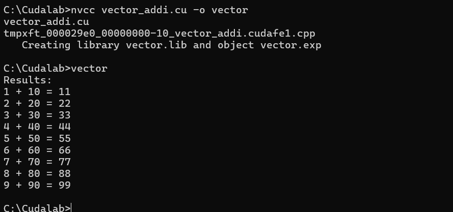

# CUDA Vector Addition Example

## Overview
This program demonstrates basic CUDA programming by performing element-wise addition of two integer arrays using GPU acceleration.

## Steps Involved

1. Set the size of the arrays and initialize the input arrays `a` and `b` on the host (CPU).
2. Allocate pointers for device (GPU) memory for arrays `a`, `b`, and `c`.
3. Use `cudaMalloc` to allocate memory for the arrays on the GPU.
4. Use `cudaMemcpy` to copy input arrays `a` and `b` from the host to the device.
5. Run the CUDA kernel with 1 block and `N` threads, where each thread computes one element of the output array.
6. Use `cudaDeviceSynchronize` and `cudaGetLastError` to ensure the kernel completed without errors.
7. Use `cudaMemcpy` to copy the result array `c` from device to host.
8. Display the results of the addition for each element.
9. Clean up by freeing the allocated GPU memory using `cudaFree`.

## Output Example  
Here’s an example of the program output:  

  

